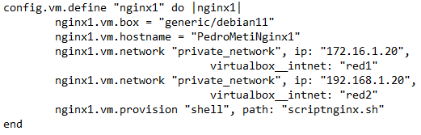
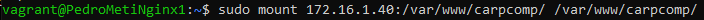

#   Índice

[1.Introducción al proyecto](#1)

[2.Configuración del VagrantFile y los scripts de aprovisionamiento.](#2)

[3.Configuración máquina MySQL.](#3)

[4.Configuración máquina NFS.](#4)

[5.Configuración máquinas Nginx.](#5)

[6.Configuración Balanceador.](#6)

# 1.Introducción al proyecto

El proyecto que vas a ver a continuación es una estructura CMS, la cual cuenta con 1 balanceador, mediante el cual vamos a haceder a la estructura; 2 servidores nginx los cuales nos van a hacer de puente para conectarnos al servidor mysql en el que tenemos nuestra base de datos; 1 maquina con un servidor nfs con el cual compartiremos una carpeta, en la cual encontramos los recursos necesarios para levantar nuestra pagina web y por último tenemos el servidor mysql en el que tendremos nuestra base de datos.

# 2.Configuración VagrantFile y scripts de aprovisionamiento.

Aqui esta la configuración del archivo **VagrantFile** con el cual levantaremos el entorno.
En este apreciamos que el balanceador esta en una subred aislada junto con los dos nginx, por otro lado encontramos el nfs el cual tmb se encuentra en otra subred junto con los dos nginx, y para acabar encontramos el mysql en otra distinta con los dos nginx.

### Configuracion del **Balanceador** en el Vagrantfile + **script**

### Configuracion del **Nginx** en el Vagrantfile + **script**

 

### Configuracion del **NFS** en el Vagrantfile + **script**

### Configuracion del **MYSQL** en el Vagrantfile + **script**

# 3.Configuración máquina MySQL.

En la máquina **MYSQL** entraremos en el directorio **/etc/mysql/mariadb.conf.d** y ahí modificaremos el archivo **50-server.cnf**.

Dentro de este cambiaremos la **bind-address** y pondremos la ip de nuestra maquina mysql **(192.168.10.1)** en lugar de **127.0.0.1**.

A continuación con el comando **sudo mysql\_secure\_installation** podremos cambiar la contraseña del **root de mysql**, este nos mostrará una sucesión de preguntas para la configuración a las que responderemos a la primera con **enter** ya que no tenemos contraseña actual de root, a las dos que sí y nos dara a escribir nuestra contraseña (en mi caso **1234**), las demas respondemos que no.

Una vez podamos haceder al mysql con el root, entramos y nos disponemos a crear el usuario el cual sera el que useamos para añadir, editar y borrar datos en nuestro CMS, para ellos debemos de crearlo con **%** en vez de con **localhost** ya que al disponer de 2 nginx no podemos usar dos direcciones IP, y le daremos permisos al usuario en la base de datos que vamos a añadir mas adelante.

En el home nos descargaremos el repositorio en el que tenemos la base de datos.

Entramos en el directorio que se nos ha creado y dentro de este en el directorio llamado **db**, una vez dentro procederemos a importar el fichero **database.sql**.

# 4.Configuración del servidor NFS.

Lo primero de todo será crear la carpeta **carpcomp** en cada directorio **/var/www** de las 3 máquinas y montarlas con el NFS para que con descargar algo en la  máquina NFS lo tengamos también en las máquinas Nginx.

Una vez creadas debemos de configurar el archivo **/etc/exports** con las rutas de las carpetas de las máquinas Nginx y las IPs de esas máquinas, importante que sean las IPs que estan en la subred del NFS.

Tras editar el archivo reiniciamos el servicio del NFS con **sudo systemctl restart nfs-kernel-server** y podremos montar las carpetas de las máquinas Nginx.

Con esto, todo lo que hagamos en la carpeta del servidor NFS, se hará también en las carpetas de las máquinas Nginx. Por lo que ahora clonaremos el repositorio de git en la carpeta de la máquina NFS y haremos todas las configuraciones en esta máquina y moveremos todo el contenido del subdirectorio src hacia la carpeta **/var/www/carpcomp**.

Editaremos el fichero config.php y en este cambiaremos en **DB_HOST** valor de **localhost** por la IP de la máquina SQL (192.168.10.1).

Ahora editaremos el archivo **/etc/php/7.4/fpm/pool.d/www.conf** y lo configuramos para poder conectarnos por socket TCP/IP. Aquí cambiaremos el contenido de la línea listen por la dirección **0.0.0.0:9000**.

# 5.Configuración máquinas Nginx.

Ahora en las máquinas Nginx editaremos **/etc/nginx/sites-enabled/default**. Dentro de este en la linea que pone root, pondremos la ruta de nuestra carpeta nfs de **/var/www/carpcomp** y mas abajo agregaremos index.php después de index.html. 

Mas abajo en el mismo archivo habrá unas líneas que empiezan por location comentadas, las descomentaremos, pero solo las que salen en la captura y en la otra línea de **fatscgi_pass** pondremos la IP de nuestro servidor NFS y el puerto 9000.

# 6.Configuración Balanceador.

## 4.1.Balanceador en modo no seguro.

Creamos el archivo **/etc/nginx/sites-available/confbalancer** y dentro copiamos la configuración de la siguiene captura, remplazando las IPs por las de las maquinas nginx (las IPs de la subred del balancer **172.16.1.20 y x.30**).

Una vez hecho esto creamos un enlace hacia sites-enabled y borraremos el default.

## 4.2.Balanceador en modo seguro.

Para configurarlo en modo seguro debemos generar unas claves certificadoras, ya que son necesarias para activar SSL en Nginx. Para ello usaremos el siguiente comando que nos creara tanto un certificado público como una clave privada: **sudo openssl req -x509 -nodes -days 365 -newkey rsa:2048 -keyout /etc/ssl/private/servernginx.com.key -out /etc/ssl/certs/servernginx.com.pem**

Ahora tendremos que irnos a nuestro fichero de configuración de Nginx que esta en **sites-enabled** y agregar las líneas necesarias para que funcione el SSL. También podremos documentar las líneas que agregamos anteriormente si queremos que a nuestra página solo se pueda acceder desde HTTPS.

Ya solo nos queda reiniciar nuestro servicio Nginx y al intentar acceder desde internet solo podremos poniendo https:// seguido de la dirección IP pública.